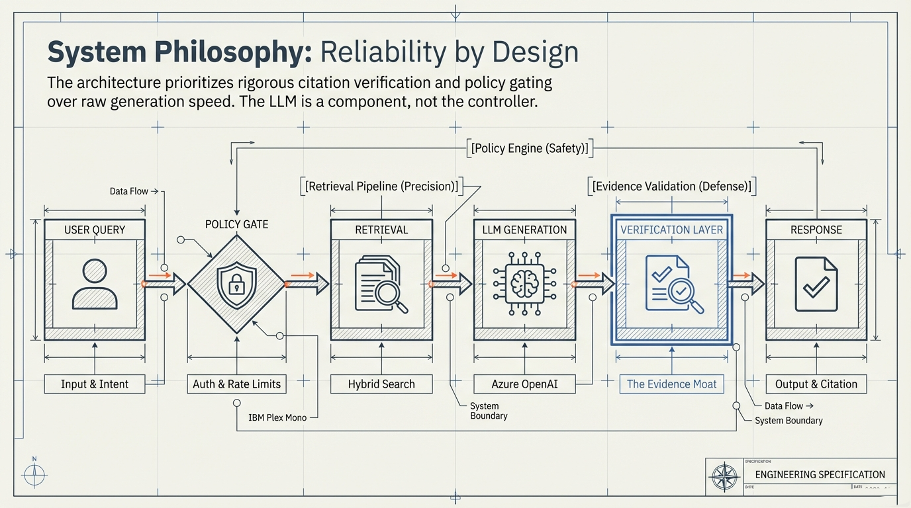

# Evidence-Bound

**Enterprise Document Q&A with Verified Citations**

Evidence-Bound is a RAG system for law firms where **every answer must cite source documents** — or the system refuses to answer. No hallucinations by design.

**Stack:** FastAPI + Next.js 16 | PostgreSQL | Azure AI Search | Azure OpenAI | Langfuse

**Docs:** [knowledge.bound.legal](https://knowledge.bound.legal) — architecture, operations, technical deep dive



---

## Quick Start

```bash
git clone https://github.com/aidevcode9/evidence-doc-qa.git
cd evidence-doc-qa

# Backend
cd apps/api && python -m venv .venv && source .venv/bin/activate
pip install -r requirements.txt
python -c "from app.db import init_db; init_db()"
uvicorn app.main:app --reload --port 8000

# Frontend (new terminal)
cd apps/web && npm install && npm run dev
```

See [Getting Started](docs/GETTING_STARTED.md) for full setup with local-only mode (no Azure required).

---

## Documentation

### For New Engineers — Start Here

| Doc | Purpose | Read when |
|-----|---------|-----------|
| **[Getting Started](docs/GETTING_STARTED.md)** | Clone to running in 10 min | First day |
| **[Architecture Diagrams](docs/ARCHITECTURE_DIAGRAM.md)** | Visual: system, RAG pipeline, data model, deploy, auth | Understanding the system |
| **[Workflow](docs/WORKFLOW.md)** | Dev process: TDD, skills, review gates | Before your first PR |

### For Understanding the System

| Doc | Purpose | Audience |
|-----|---------|----------|
| **[Technical Deep Dive](docs/TECHNICAL_DEEP_DIVE.md)** | RAG pipeline internals, caching, cost tracking, PII, testing | Engineers |
| **[Architecture Overview](docs/ARCHITECTURE_OVERVIEW.md)** | System overview with data model and deployment tiers | Investors, interviewers |
| **[Architecture Review](docs/ARCHITECTURE_REVIEW.md)** | Honest gaps + what we'd build differently | Senior engineers |
| **[LLM Providers](docs/LLM_PROVIDERS.md)** | Configure Azure OpenAI, Anthropic, Gemini, Ollama | DevOps, config |

### For Operating in Production

| Doc | Purpose | Audience |
|-----|---------|----------|
| **[Operations Runbook](docs/OPERATIONS.md)** | Deploy, monitor, diagnose, rollback | Ops, on-call |
| **[.env.example](.env.example)** | All env vars with defaults | Source of truth for config |

### Strategic

| Doc | Purpose |
|-----|---------|
| **[RAG Harness Spec](docs/RAG_HARNESS_SPEC.md)** | Extracting a reusable, production-grade RAG framework from this codebase |

### Reference (Deep Dives)

| Doc | Purpose |
|-----|---------|
| [architecture/data-model.md](docs/architecture/data-model.md) | Full database schema |
| [architecture/interfaces.md](docs/architecture/interfaces.md) | Provider abstraction interfaces |
| [architecture/migrations.md](docs/architecture/migrations.md) | Schema migration patterns |
| [planning/MULTI_TENANT_READINESS.md](docs/planning/MULTI_TENANT_READINESS.md) | SaaS readiness gap analysis |

### Project Management

| Doc | Purpose |
|-----|---------|
| [STATUS.md](STATUS.md) | Current sprint — what's now, next, done |
| [REQUIREMENTS.md](REQUIREMENTS.md) | FRs/NFRs with acceptance criteria |
| [CLAUDE.md](CLAUDE.md) | AI assistant operating instructions |

---

## Core Guarantee

```
If the system returns an answer:
  1. It cites a specific document, page, and character range
  2. The cited text exists verbatim in the source
  3. Confidence score is above threshold (default 0.70)
  4. Evidence grade (A/B/C) based on verification status

If it can't verify → it refuses. Every time.
```

---

## Architecture

```
Next.js 16 (Vercel)
  │
FastAPI (Azure Container Apps)
  ├── Auth: JWT + Google SSO + RBAC (4 roles)
  ├── Tenant isolation: tenant_id + matter_id on every query
  ├── RAG Pipeline:
  │     Injection Gate → Embed → Hybrid Search → Verify → Grade → Cite
  │
  ├── PostgreSQL (Azure Flexible Server) — 11 tables, all tenant-scoped
  ├── Azure AI Search (BM25 + vector + semantic reranker)
  ├── Azure OpenAI (text-embedding-3-large + GPT-5-mini)
  ├── Langfuse (LLM observability, PII-safe)
  └── OpenTelemetry (spans + custom metrics)
```

---

## Quality Gates

```bash
ruff check apps/                    # Lint
mypy apps/api/app --strict          # Type check
pytest tests/ -v                    # 649+ unit + integration tests
pytest evals/ -v                    # Golden query evals (>95% pass)
```

All enforced via pre-commit hooks. See [Workflow](docs/WORKFLOW.md).

---

## License

MIT License — see [LICENSE](LICENSE) for details.

---

**Author:** Chuck Hernandez | [LinkedIn](https://linkedin.com/in/chuck-hernandez)
