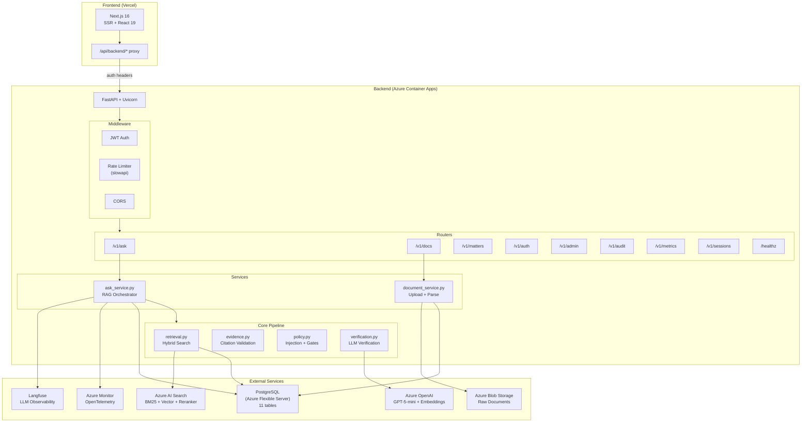
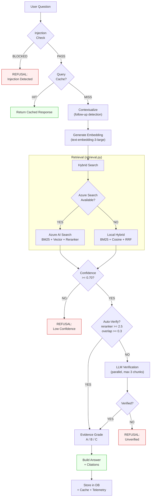
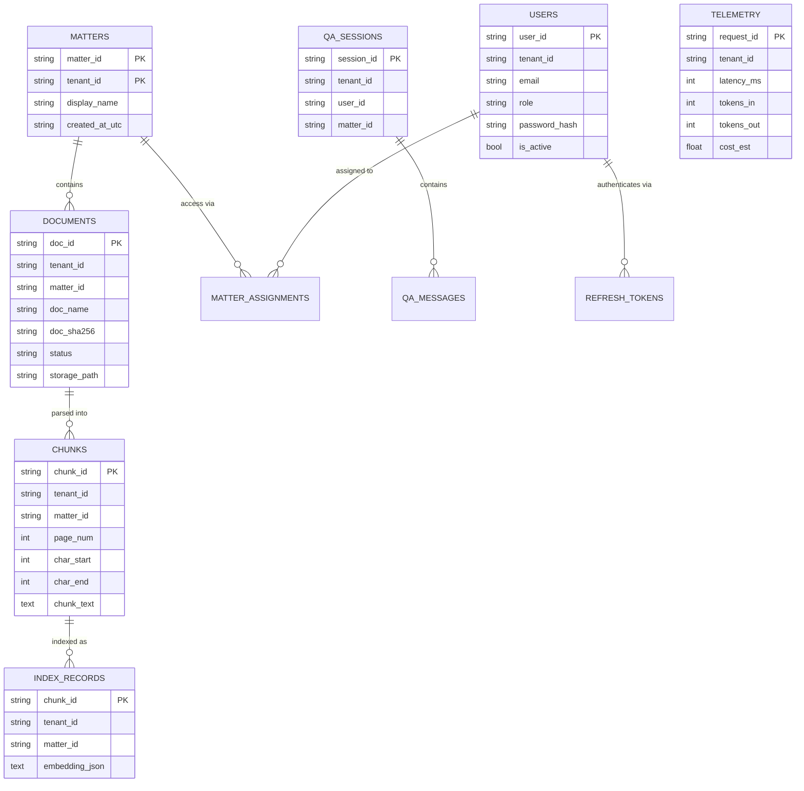
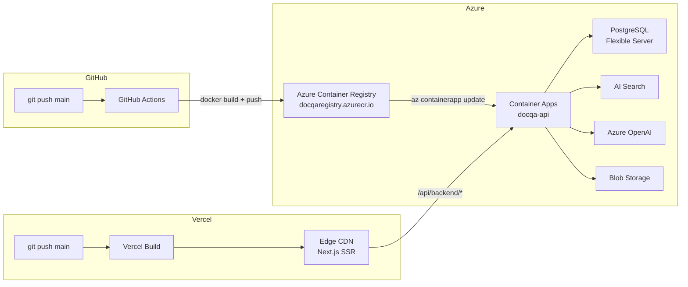
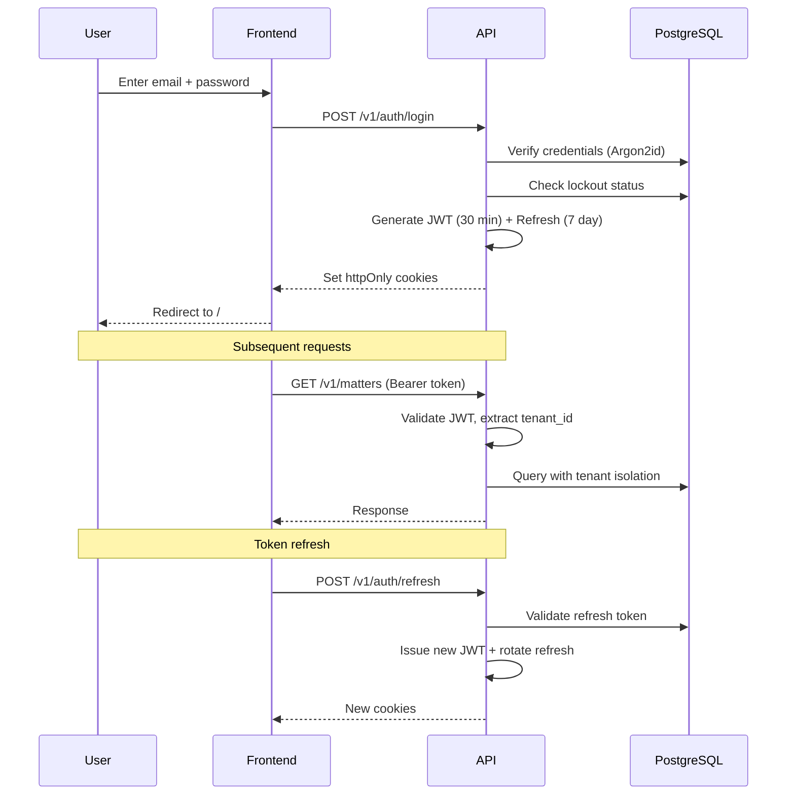

# Architecture Diagrams

> Maintained as Mermaid — renders in GitHub, VS Code, and most markdown viewers.
> Last updated: 2026-04-02

---

## System Overview

---

## RAG Pipeline Flow

---

## Data Model

---

## Deployment Architecture

---

## Authentication Flow

